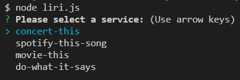
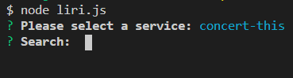
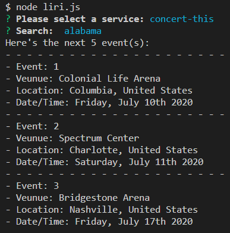
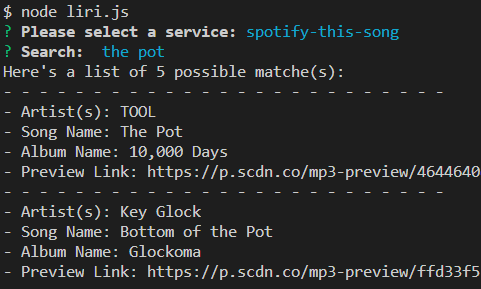
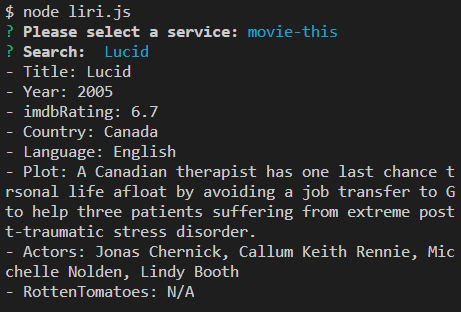
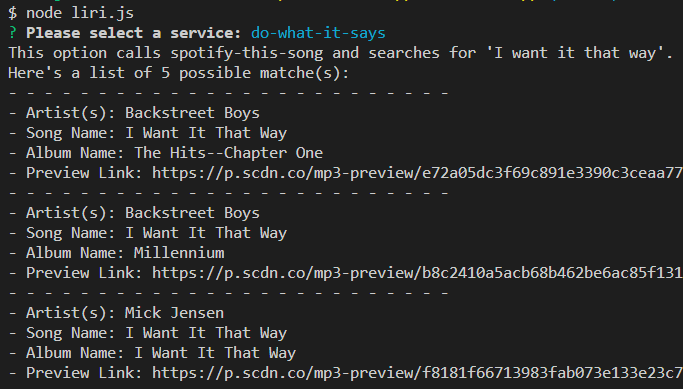

# liri-node-app

## General Information

This app is a LIRI. A LIRI is like iPhone's SIRI. However, while SIRI is 
a Speech Interpretation and Recognition Interface, LIRI is a _Language_ 
Interpretation and Recognition Interface. This is a command line node app 
that takes in parameters and gives the user back some data for concerts, 
songs, or movies.

## Overview / Organization

This app allows the a user to select a function with an inquirer menu in 
the CLI.
Options:
- Concert-this
- spotify-this-song
- movie-this
- do-what-it-says

Once an option is selected, the user will generally be prompted for
the search criteria.

### Concert-this

The user can search for a singer or band. Once the search is entered, the
program will return a few matches for the upcoming concerts with date, venue,
etc. 

### Spotify-this-song

This feature allows the user to do a song search via Spotify. A few of the 
closest matches will be returned with the name, album, and preview link.

### Movie-this

When used, the move most closely matching the search entered will be returned.
It will provide year, rating, plot, and other information. 

### Do-what-it-says

This option takes pre-entered information from a text file and searches for it
via the spotify-this-song function. It is currently set to search for 'I want
it that way'. 

## Technologies Used

Node.js, Javascript, CLI, Moment, Axios, Inquirer, API (omdb, spotify, bandsintown)

## Creation

This app was created by me based on assignment requirements.
